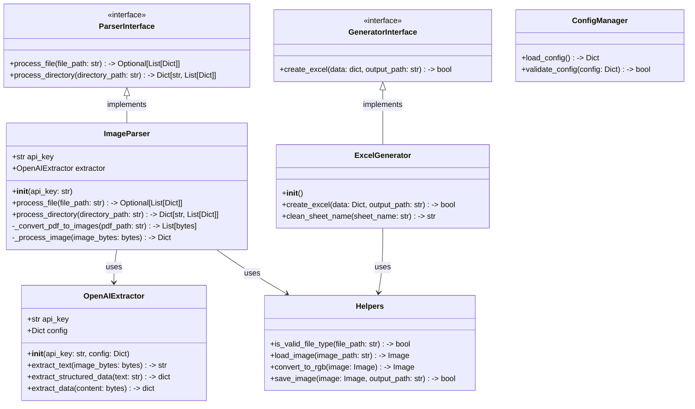
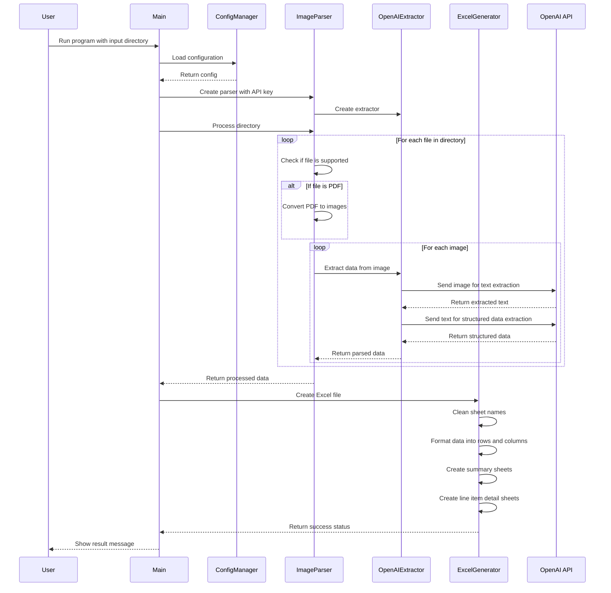

# Image to Excel Converter

This project provides a powerful tool for converting data from images and PDFs into structured Excel files. It uses OpenAI's Vision API to extract text and tabular data from images and automatically formats them into well-organized Excel spreadsheets.

## Features

- Image and PDF text extraction using OpenAI's Vision API
- **Structured data extraction** from invoices with key information parsing
- Excel file generation with properly formatted data in rows and columns
- Support for multiple formats (PDF, PNG, JPEG, JPG)
- Simple command-line interface
- Comprehensive test coverage (91%)
- YAML-based configuration
- Robust error handling and validation
- Clean and maintainable code structure

## Project Structure

```
image-to-excel
├── src
│   ├── __init__.py
│   ├── main.py                # Entry point of the application
│   ├── interfaces
│   │   ├── __init__.py
│   │   ├── generator_interface.py  # Interface for generators
│   │   └── parser_interface.py     # Interface for parsers
│   ├── parsers
│   │   ├── __init__.py
│   │   ├── image_parser.py         # Image/PDF processing
│   │   └── openai_extractor.py     # OpenAI API integration
│   ├── generators
│   │   ├── __init__.py
│   │   └── excel_generator.py      # Excel file creation
│   └── utils
│       ├── __init__.py
│       ├── config_manager.py       # Configuration management
│       └── helpers.py             # Utility functions
├── conf
│   └── api_config.yaml           # Configuration settings
├── requirements.txt              # Project dependencies
├── README.md                    # Project documentation
├── pytest.ini                  # Pytest configuration
└── tests                       # Unit and integration tests
    ├── __init__.py
    ├── test_config_manager.py
    ├── test_excel_generator.py
    ├── test_helpers.py
    ├── test_image_parser.py
    ├── test_main.py
    ├── test_openai_extractor.py
    └── test_parsers.py
```

## Class Diagram



## Sequence Diagram



## Libraries Used

### Core Dependencies
- **openai (v1.0.0+)**
  - Used for Vision API integration
  - Handles image analysis and text extraction
  - Now also used for structured data extraction from text
  - Supports both vision and chat completions APIs
- **openpyxl (v3.1.0+)**
  - Excel file creation and manipulation
  - Used as the engine for pandas Excel output
- **pandas (v2.0.0+)**
  - Data manipulation and analysis
  - DataFrame creation for Excel output
  - Structured data formatting in rows and columns
- **Pillow (v10.0.0+)**
  - Image processing library
  - Handles various image formats
  - Image manipulation and conversion
- **pdf2image (v1.16.0+)**
  - PDF conversion to images
  - Makes PDFs compatible with image-based OCR
- **PyMuPDF (v1.22.0+)**
  - Enhanced PDF processing
  - PDF document parsing
  - Page extraction from PDF files

### Utility Libraries
- **numpy (v1.24.0+)**
  - Numerical operations
  - Used for data processing
- **requests (v2.31.0+)**
  - HTTP requests
  - API communication
- **pyyaml (v6.0.0+)**
  - YAML file parsing
  - Configuration management
- **loguru (v0.7.2+)**
  - Enhanced logging
  - Debug information
  - Error tracking

### Testing Libraries
- **pytest (v7.0.0+)**
  - Test framework
  - Test discovery and execution
- **pytest-cov (v4.1.0+)**
  - Code coverage measurement
  - Missing line identification

## Configuration

The application uses a YAML-based configuration file (`conf/api_config.yaml`) for managing settings:

1. Copy the example config:
   ```bash
   cp conf/api_config.yaml.example conf/api_config.yaml
   ```

2. Update the configuration in `api_config.yaml`:
   ```yaml
   openai:
     api_key: "your-api-key-here"  # Replace with your OpenAI API key
     vision:
       model: "gpt-4-vision-preview"
       max_tokens: 1000
       messages:
         - role: "user"
           content:
             - type: "text"
               text: "Extract all invoice details from this image including invoice number, date, items, quantities, prices, and totals. Format the response as a JSON object."
             - type: "image"
               image_url: null  # Will be replaced with actual image data
     chat:
       model: "gpt-4"
       max_tokens: 2000

   output:
     excel:
       default_filename: "output.xlsx"
   ```

## Requirements

- Python 3.11 or higher
- Dependencies listed in requirements.txt

## Setup Instructions

1. Clone the repository:
   ```bash
   git clone https://github.com/yourusername/image_to_excel.git
   cd image_to_excel
   ```

2. Create and activate a virtual environment (recommended):
   ```bash
   python -m venv .venv
   source .venv/bin/activate  # On Windows: .venv\Scripts\activate
   ```

3. Install the required dependencies:
   ```bash
   pip install -r requirements.txt
   ```

4. Configure the application:
   ```bash
   cp conf/api_config.yaml.example conf/api_config.yaml
   # Edit conf/api_config.yaml and add your OpenAI API key
   ```

## Usage

Run the application:
```bash
python -m src.main <input_directory> <output_file>
```

The program will:
1. Process all images and PDFs in the input directory
2. Extract data using OpenAI's Vision API
3. Parse the extracted text into structured data
4. Generate an Excel file with the data organized in rows and columns

### Example
```bash
# Process files in 'invoices' directory and save to 'output.xlsx'
python -m src.main ./invoices output.xlsx

# Process files using a specific data directory
python -m src.main "./data/INVOICES FOR WELLSTONE DRUGS PURCHASES (2024)" output.xlsx
```

## Excel Output Format

The application generates Excel files with data organized in the following format:

1. **Summary Sheets**: 
   - One sheet per directory containing summary information
   - Columns include: Invoice ID, Date, Vendor, Customer, Total Amount, Currency, Payment Terms

2. **Line Item Sheets**:
   - Separate sheets for line item details from each invoice
   - Columns include: Invoice ID, Description, Quantity, Unit Price, Amount

## Testing

The project includes a comprehensive test suite. To run the tests:

```bash
# Run tests with coverage report
pytest --cov=src --cov-report=term-missing

# Run tests without coverage
pytest

# Run tests with verbose output
pytest -v
```

### Latest Test Coverage Report

```
Name                                    Stmts   Miss  Cover   Missing
---------------------------------------------------------------------
src/__init__.py                             0      0   100%
src/generators/__init__.py                  0      0   100%
src/generators/excel_generator.py          78      5    94%   36, 76-77, 154-155
src/interfaces/__init__.py                  0      0   100%
src/interfaces/generator_interface.py       5      1    80%   18
src/interfaces/parser_interface.py         25      6    76%   12, 17, 25, 33, 48, 60
src/main.py                                39      6    85%   19, 37-38, 58-59, 62
src/parsers/__init__.py                     0      0   100%
src/parsers/image_parser.py               131     12    91%   42-44, 62-64, 92-94, 186-188
src/parsers/openai_extractor.py            68      7    90%   67-68, 81-82, 154, 164-165
src/utils/__init__.py                       0      0   100%
src/utils/config_manager.py                31      0   100%
src/utils/helpers.py                       43      0   100%
---------------------------------------------------------------------
TOTAL                                     420     37    91%
```

## Recent Changes

1. Excel Output Formatting:
   - **Improved data formatting**: Data now appears in structured rows and columns instead of JSON dumps
   - **Summary and detail sheets**: Created separate sheets for invoice summaries and line item details
   - **Enhanced column organization**: Data is now organized with meaningful column headers
   - **Support for larger datasets**: Excel output can handle more data through better sheet organization

2. Enhanced Data Extraction:
   - **Structured data extraction**: Added capability to parse raw text into structured invoice data
   - **Two-stage extraction process**: First extracts text, then processes it into structured format
   - **Field-specific parsing**: Extracts invoice numbers, dates, vendors, line items, etc.
   - **Enhanced PDF processing**: Better handling of multi-page PDF documents

3. Code Improvements:
   - **Improved OpenAI extractor**: Enhanced to handle both raw text and structured data
   - **Better error handling**: Added fallbacks when structured extraction fails
   - **Enhanced test coverage**: Added tests for new structured data extraction features
   - **Version requirements**: Specified version requirements for all dependencies
   - **Current test coverage**: Maintained 91% overall coverage with 420 statements tested

4. Documentation:
   - Updated class and sequence diagrams to reflect new functionality
   - Added details about the Excel output format
   - Updated command-line usage instructions
   - Documented configuration requirements for chat model
   - Updated test coverage report with latest metrics

## License

This project is licensed under the MIT License - see the LICENSE file for details.
