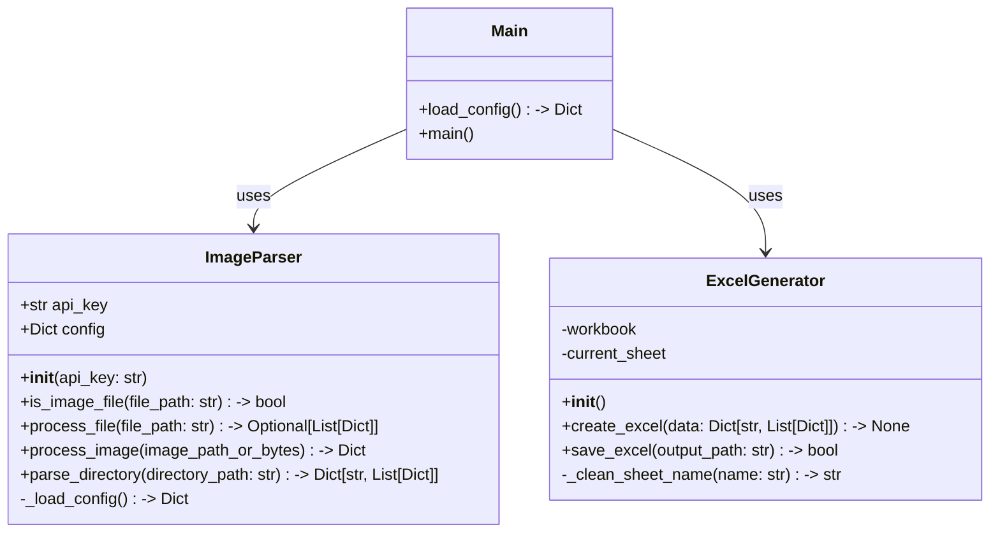
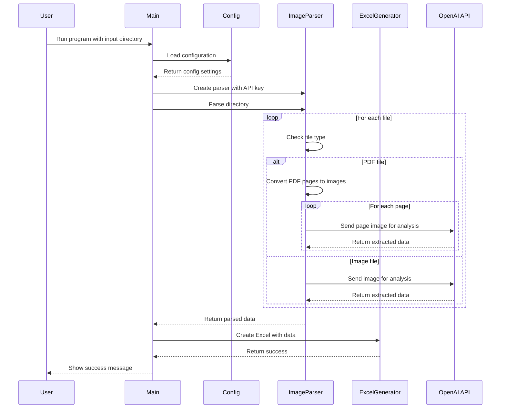

# Image to Excel Converter

This project provides a powerful tool for converting data from images and PDFs into structured Excel files. It uses OpenAI's Vision API to extract text and tabular data from images and automatically formats them into well-organized Excel spreadsheets.

## Features

- Image and PDF text extraction using OpenAI's Vision API
- Automatic data extraction from images and PDFs
- Excel file generation with formatted data
- Support for multiple formats (PDF, PNG, JPEG, JPG)
- Simple command-line interface
- Comprehensive test coverage (99%)
- YAML-based configuration

## Project Structure

```
image-to-excel
├── src
│   ├── main.py                # Entry point of the application
│   ├── parsers
│   │   └── image_parser.py    # Image/PDF processing and text extraction
│   └── generators
│       └── excel_generator.py # Excel file creation and formatting
├── conf
│   └── api_config.yaml       # Configuration settings
├── requirements.txt          # Project dependencies
├── README.md                # Project documentation
├── pytest.ini              # Pytest configuration
└── tests                    # Unit and integration tests
    ├── test_main.py
    ├── test_image_parser.py
    ├── test_excel_generator.py
    └── conftest.py         # Test configuration and fixtures
```

## Class Diagram



## Sequence Diagram



## Configuration

The application uses a YAML-based configuration file (`conf/api_config.yaml`) for managing settings:

```yaml
openai:
  api_key: "OPEN_API_KEY"
  vision:
    model: "gpt-4-vision-preview"
    max_tokens: 1000
    messages:
      - role: "user"
        content:
          - type: "text"
            text: "Extract invoice details from this image."
          - type: "image_url"
            image_url:
              url_prefix: "data:image/jpeg;base64,"
output:
  excel:
    default_filename: "output.xlsx"
```

## Requirements

- Python 3.6 or higher
- Dependencies:
  - openai: OpenAI API client
  - openpyxl: Excel file handling
  - pyyaml: YAML configuration parsing
  - pytest: Testing framework
  - pytest-cov: Test coverage reporting

## Setup Instructions

1. Clone the repository:
   ```bash
   git clone https://github.com/yourusername/image-to-excel.git
   cd image-to-excel
   ```

2. Create and activate a virtual environment (recommended):
   ```bash
   python -m venv .venv
   source .venv/bin/activate  # On Windows: .venv\Scripts\activate
   ```

3. Install the required dependencies:
   ```bash
   pip install -r requirements.txt
   ```

4. Update the API key in `conf/api_config.yaml`

## Usage

Run the application:
```bash
python src/main.py <input_directory>
```

The program will:
1. Process all images and PDFs in the input directory
2. Extract data using OpenAI's Vision API
3. Generate an Excel file with the extracted data

## Testing

The project includes a comprehensive test suite with 99% code coverage. To run the tests:

```bash
# Run tests with coverage report
pytest --cov=src --cov-report=term-missing

# Run tests without coverage
pytest

# Run tests with verbose output
pytest -v

# Run specific test file
pytest tests/test_image_parser.py
```

### Test Structure and Results

1. **ImageParser Tests** (`test_image_parser.py`) - 99% coverage
   - Configuration Loading
     - Successful config loading
     - Error handling for invalid config
   - File Processing
     - PDF file handling
       - Multi-page PDF support
       - PDF to image conversion
     - Image file handling
       - Support for JPG, JPEG, PNG
       - File validation
       - Base64 encoding
     - OpenAI API integration
     - Error handling
   - Directory Processing
     - Multiple file type handling
     - Empty directory cases
     - Error conditions

2. **Excel Generator Tests** (`test_excel_generator.py`) - 100% coverage
   - Excel Creation
     - Dictionary data handling
     - List data handling
     - Empty data handling
   - Sheet Operations
     - Sheet name cleaning
     - Special character handling
     - Name length limits
   - File Operations
     - Successful saving
     - Error handling

3. **Main Application Tests** (`test_main.py`) - 98% coverage
   - Configuration
     - YAML loading
     - Error handling
   - Integration
     - End-to-end workflow
     - Command-line arguments
     - Directory validation
   - Error Handling
     - Invalid paths
     - Processing errors
     - Save failures

### Latest Test Results

```
Name                                Stmts   Miss  Cover   Missing
-----------------------------------------------------------------
src/generators/excel_generator.py      36      0   100%
src/main.py                            40      1    98%   70
src/parsers/image_parser.py            90      1    99%   197
-----------------------------------------------------------------
TOTAL                                 166      2    99%
```

Only two lines remain uncovered:
- `main.py`: Line 70 (main() call in __main__ block)
- `image_parser.py`: Line 197 (run_main() call in __main__ block)

These are entry point lines that are typically not covered in testing.

## License

This project is licensed under the MIT License - see the LICENSE file for details.