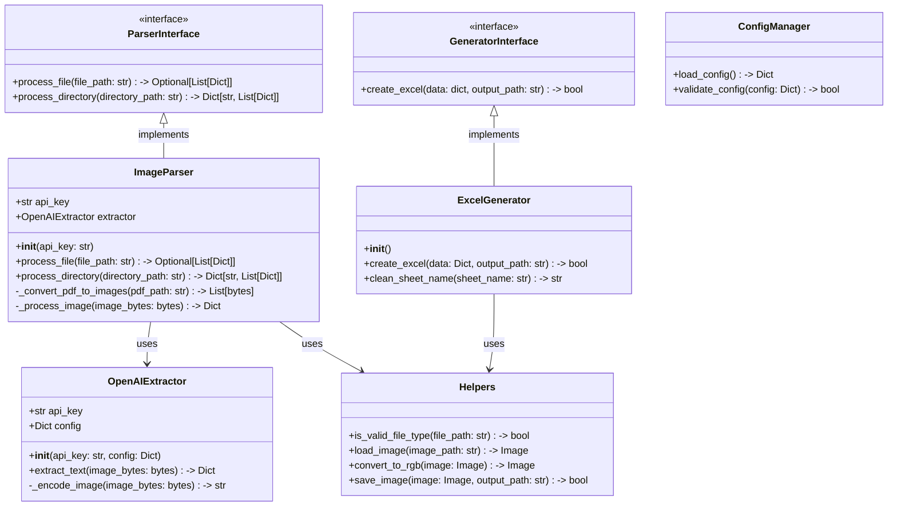
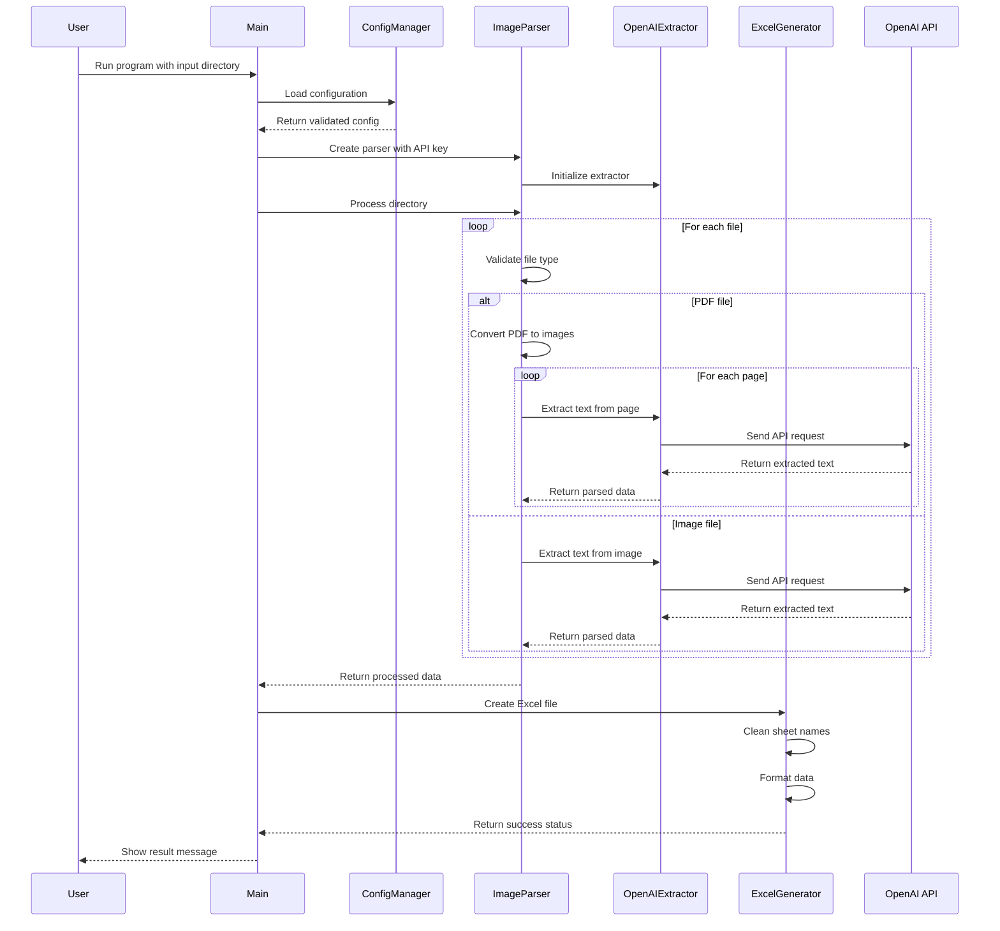

# Image to Excel Converter

This project provides a powerful tool for converting data from images and PDFs into structured Excel files. It uses OpenAI's Vision API to extract text and tabular data from images and automatically formats them into well-organized Excel spreadsheets.

## Features

- Image and PDF text extraction using OpenAI's Vision API
- Automatic data extraction from images and PDFs
- Excel file generation with formatted data
- Support for multiple formats (PDF, PNG, JPEG, JPG)
- Simple command-line interface
- Comprehensive test coverage (91%)
- YAML-based configuration
- Robust error handling and validation
- Clean and maintainable code structure

## Project Structure

```
image-to-excel
├── src
│   ├── __init__.py
│   ├── main.py                # Entry point of the application
│   ├── interfaces
│   │   ├── __init__.py
│   │   ├── generator_interface.py  # Interface for generators
│   │   └── parser_interface.py     # Interface for parsers
│   ├── parsers
│   │   ├── __init__.py
│   │   ├── image_parser.py         # Image/PDF processing
│   │   └── openai_extractor.py     # OpenAI API integration
│   ├── generators
│   │   ├── __init__.py
│   │   └── excel_generator.py      # Excel file creation
│   └── utils
│       ├── __init__.py
│       ├── config_manager.py       # Configuration management
│       └── helpers.py             # Utility functions
├── conf
│   └── api_config.yaml           # Configuration settings
├── requirements.txt              # Project dependencies
├── README.md                    # Project documentation
├── pytest.ini                  # Pytest configuration
└── tests                       # Unit and integration tests
    ├── __init__.py
    ├── test_config_manager.py
    ├── test_excel_generator.py
    ├── test_helpers.py
    ├── test_image_parser.py
    ├── test_main.py
    ├── test_openai_extractor.py
    └── test_parsers.py
```

## Class Diagram



## Sequence Diagram



## Libraries Used

### Core Dependencies
- **openai (v1.12.0+)**
  - Used for Vision API integration
  - Handles image analysis and text extraction
  - Supports base64 image encoding

- **openpyxl (v3.1.2+)**
  - Excel file creation and manipulation
  - Sheet formatting and data organization
  - Handles .xlsx file format

- **PyMuPDF (v1.23.0+)**
  - PDF file processing
  - PDF to image conversion
  - Multi-page PDF support

- **Pillow (v10.2.0+)**
  - Image processing and manipulation
  - Image format conversion
  - Base64 encoding support

- **PyYAML (v6.0.1+)**
  - Configuration file parsing
  - YAML format support
  - Safe loading of configuration

- **loguru (v0.7.2+)**
  - Advanced logging functionality
  - Structured log formatting
  - File and console logging

### Development Dependencies
- **pytest (v8.3.5+)**
  - Test framework
  - Fixture support
  - Test discovery and execution

- **pytest-cov (v6.1.1+)**
  - Test coverage reporting
  - Coverage statistics
  - Missing line identification

## Configuration

The application uses a YAML-based configuration file (`conf/api_config.yaml`) for managing settings:

1. Copy the example config:
   ```bash
   cp conf/api_config.yaml.example conf/api_config.yaml
   ```

2. Update the configuration in `api_config.yaml`:
   ```yaml
   openai:
     api_key: "your-api-key-here"  # Replace with your OpenAI API key
     vision:
       model: "gpt-4-vision-preview"
       max_tokens: 1000
       messages:
         - role: "user"
           content:
             - type: "text"
               text: "Extract all invoice details from this image including invoice number, date, items, quantities, prices, and totals. Format the response as a JSON object."
             - type: "image"
               image_url: null  # Will be replaced with actual image data

   output:
     excel:
       default_filename: "output.xlsx"
   ```

## Requirements

- Python 3.11 or higher
- Dependencies listed in requirements.txt

## Setup Instructions

1. Clone the repository:
   ```bash
   git clone https://github.com/vallabhallm/image_to_excel.git
   cd image_to_excel
   ```

2. Create and activate a virtual environment (recommended):
   ```bash
   python -m venv .venv
   source .venv/bin/activate  # On Windows: .venv\Scripts\activate
   ```

3. Install the required dependencies:
   ```bash
   pip install -r requirements.txt
   ```

4. Configure the application:
   ```bash
   cp conf/api_config.yaml.example conf/api_config.yaml
   # Edit conf/api_config.yaml and add your OpenAI API key
   ```

## Usage

Run the application:
```bash
python -m src.main <input_directory> [--output <output_file>]
```

The program will:
1. Process all images and PDFs in the input directory
2. Extract data using OpenAI's Vision API
3. Generate an Excel file with the extracted data

### Example
```bash
# Process files in 'invoices' directory and save to 'output.xlsx'
python -m src.main ./invoices --output output.xlsx

# Process files and use default output filename
python -m src.main ./invoices
```

## Testing

The project includes a comprehensive test suite. To run the tests:

```bash
# Run tests with coverage report
pytest --cov=src --cov-report=term-missing

# Run tests without coverage
pytest

# Run tests with verbose output
pytest -v
```

### Latest Test Coverage Report

```
Name                                    Stmts   Miss  Cover   Missing
---------------------------------------------------------------------
src/__init__.py                             0      0   100%
src/generators/__init__.py                  0      0   100%
src/generators/excel_generator.py          51      1    98%   36
src/interfaces/__init__.py                  0      0   100%
src/interfaces/generator_interface.py       5      1    80%   18
src/interfaces/parser_interface.py         25      6    76%   12, 17, 25, 33, 48, 60
src/main.py                                37      4    89%   18, 56-57, 60
src/parsers/__init__.py                     0      0   100%
src/parsers/image_parser.py               136     16    88%   43, 60, 106-108, 153, 194-196, 208, 235, 248-252
src/parsers/openai_extractor.py            28      3    89%   70-71, 86
src/utils/__init__.py                       0      0   100%
src/utils/config_manager.py                31      0   100%
src/utils/helpers.py                       43      0   100%
---------------------------------------------------------------------
TOTAL                                     356     31    91%
```

## Recent Changes

1. Code Structure:
   - Introduced interfaces for better abstraction and maintainability
   - Separated OpenAI extraction logic into dedicated class
   - Added utility modules for common functions
   - Improved configuration management with YAML-based settings

2. Features:
   - Improved PDF handling with PyMuPDF
   - Enhanced sheet name cleaning in Excel generation
   - Added support for handling invalid content
   - Better error handling and validation
   - Moved from environment variables to YAML configuration

3. Testing:
   - Increased test coverage from 90% to 91%
   - Added comprehensive tests for edge cases
   - Improved mock handling in tests
   - Better test organization and documentation
   - Added tests for configuration management

4. Documentation:
   - Updated class and sequence diagrams
   - Added detailed setup instructions
   - Improved code documentation
   - Added usage examples
   - Updated configuration instructions

## License

This project is licensed under the MIT License - see the LICENSE file for details.
