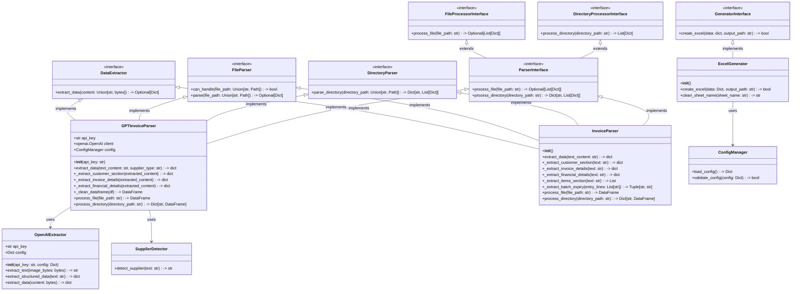
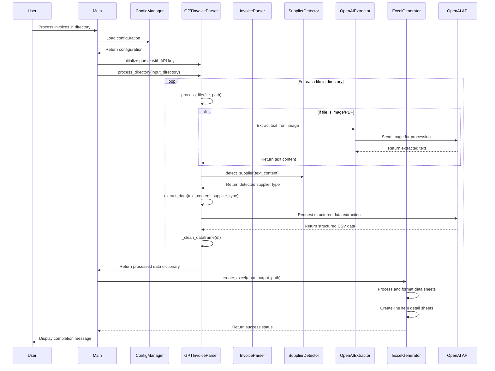

# Image to Excel Converter

This project provides a powerful tool for converting data from images and PDFs into structured Excel files. It uses OpenAI's GPT-4o to extract structured data from invoice text and automatically formats them into well-organized Excel spreadsheets.

## Features

- Image and PDF text extraction using OpenAI's Vision API
- **AI-powered structured data extraction** from invoices using GPT-4o
- Flexible handling of various invoice formats without custom parsing rules
- Excel file generation with properly formatted data in rows and columns
- Support for multiple formats (PDF, PNG, JPEG, JPG, TXT)
- Simple command-line interface
- Comprehensive test coverage (89%)
- YAML-based configuration
- Robust error handling and validation
- Clean and maintainable code structure following SOLID principles

## Project Structure

```
image-to-excel
├── src
│   ├── __init__.py
│   ├── main.py                # Entry point of the application
│   ├── extract_invoice_data.py # Invoice data extraction utilities
│   ├── interfaces
│   │   ├── __init__.py
│   │   ├── generator_interface.py  # Interface for generators
│   │   └── parser_interface.py     # Interface for parsers
│   ├── parsers
│   │   ├── __init__.py
│   │   ├── image_parser.py         # Image/PDF processing
│   │   ├── invoice_parser.py       # Base invoice parser
│   │   ├── gpt_invoice_parser.py   # GPT-4o based invoice parser
│   │   └── openai_extractor.py     # OpenAI API integration
│   ├── generators
│   │   ├── __init__.py
│   │   └── excel_generator.py      # Excel file creation
│   └── utils
│       ├── __init__.py
│       ├── config_manager.py       # Configuration management
│       ├── supplier_detector.py    # Supplier type detection 
│       ├── supplier_templates.py   # Templates for different suppliers
│       ├── extraction_config.py    # Extraction configuration
│       └── helpers.py              # Utility functions
├── conf
│   └── api_config.yaml           # Configuration settings
├── requirements.txt              # Project dependencies
├── README.md                    # Project documentation
├── pytest.ini                  # Pytest configuration
└── tests                       # Unit and integration tests
    ├── __init__.py
    ├── test_config_manager.py
    ├── test_dataframe_cleaning.py
    ├── test_date_time_normalization.py
    ├── test_excel_generator.py
    ├── test_extract_invoice_data.py
    ├── test_extraction_config.py
    ├── test_generator_interface.py
    ├── test_gpt_invoice_parser.py
    ├── test_helpers.py
    ├── test_image_parser.py
    ├── test_invoice_parser.py
    ├── test_main.py
    ├── test_openai_extractor.py
    ├── test_parser_interface.py
    ├── test_parsers.py
    ├── test_supplier_detector.py
    ├── test_supplier_parsing_integration.py
    └── test_supplier_templates.py
```

## Class Diagram



## Sequence Diagram



## Libraries Used

### Core Dependencies
- **openai (v1.0.0+)**
  - Used for Vision API integration and GPT-4o text processing
  - Handles image analysis, text extraction, and structured data extraction
- **openpyxl (v3.1.0+)**
  - Excel file manipulation
  - Sheet creation and formatting
- **pandas (v2.0.0+)**
  - Data manipulation and analysis
  - DataFrame handling for structured data
- **numpy (v1.24.0+)**
  - Numerical operations for data processing
- **PyMuPDF (v1.22.0+)**
  - PDF processing library
  - Text and image extraction from PDFs
- **Pillow (v10.0.0+)**
  - Image processing
  - Format conversion and manipulation
- **PyYAML (v6.0+)**
  - YAML configuration file handling
  - Configuration loading and parsing
- **loguru (v0.7.0+)**
  - Enhanced logging
  - Debug and error tracking

### Development Dependencies
- **pytest (v8.0.0+)**
  - Test framework
  - Test discovery and execution
- **pytest-cov (v4.1.0+)**
  - Code coverage measurement
  - Missing line identification

## Configuration

The application uses a YAML-based configuration file (`conf/api_config.yaml`) for managing settings:

1. Copy the example config:
   ```bash
   cp conf/api_config.yaml.example conf/api_config.yaml
   ```

2. Update the configuration in `api_config.yaml`:
   ```yaml
   openai:
     api_key: "your-api-key-here"  # Replace with your OpenAI API key
     models:
       chat: "gpt-4o"             # Model for text processing
       vision: "gpt-4o"           # Model for vision API
     temperature: 0.1             # Lower value for more deterministic outputs
     max_tokens: 4000             # Maximum tokens in response
   
   extraction:
     batch_regex: 
       - "(?i)batch[:\\s]+([\\w\\d-]+)"
       - "(?i)lot[:\\s]+([\\w\\d-]+)"
     expiry_regex:
       - "(?i)expiry[:\\s]+(\\d{1,2}[/\\.-]\\d{1,2}[/\\.-]\\d{2,4})"
       - "(?i)exp[:\\s]+(\\d{1,2}[/\\.-]\\d{1,2}[/\\.-]\\d{2,4})"
   
   output:
     default_filename: "output.xlsx"
   ```

## Requirements

- Python 3.11 or higher
- Dependencies listed in requirements.txt

## Setup Instructions

1. Clone the repository:
   ```bash
   git clone https://github.com/yourusername/image_to_excel.git
   cd image_to_excel
   ```

2. Create and activate a virtual environment (recommended):
   ```bash
   python -m venv .venv
   source .venv/bin/activate  # On Windows: .venv\Scripts\activate
   ```

3. Install the required dependencies:
   ```bash
   pip install -r requirements.txt
   ```

4. Configure the application:
   ```bash
   cp conf/api_config.yaml.example conf/api_config.yaml
   # Edit conf/api_config.yaml and add your OpenAI API key
   ```

## Usage

Run the application:
```bash
python -m src.main <input_directory> <output_file>
```

This will:
1. Process all invoice files (text, images, PDFs) in the input directory
2. Use GPT-4o to convert invoice text to structured CSV data
3. Generate an Excel file with the data organized in rows and columns

### Example
```bash
# Process files in 'invoices' directory and save to 'output.xlsx'
python -m src.main ./invoices output.xlsx

# Process a single invoice text file
python -m src.extract_invoice_data sample_invoice.txt output_invoice.xlsx
```

## Excel Output Format

The application generates Excel files with data organized in the following format:

1. **Summary Sheets**: 
   - One sheet per directory containing summary information
   - Columns include: Invoice ID, Date, Vendor, Customer, Total Amount, Currency, Payment Terms

2. **Line Item Sheets**:
   - Separate sheets for line item details from each invoice
   - Columns include: Invoice ID, Description, Quantity, Unit Price, Amount, Batch Number, Expiry Date

## Testing

The project includes a comprehensive test suite. To run the tests:

```bash
# Run tests with coverage report
pytest --cov=src --cov-report=term-missing

# Run tests without coverage
pytest

# Run tests with verbose output
pytest -v
```

### Latest Test Coverage Report

```
Name                                    Stmts   Miss  Cover   Missing
---------------------------------------------------------------------
src/__init__.py                             0      0   100%
src/extract_invoice_data.py                48      1    98%   94
src/generators/__init__.py                  0      0   100%
src/generators/excel_generator.py         168     24    86%   37, 138-139, 142-143, 151-152, 180, 198-210, 252-253, 261-266
src/interfaces/__init__.py                  0      0   100%
src/interfaces/generator_interface.py       5      1    80%   18
src/interfaces/parser_interface.py         30      7    77%   12, 17, 25, 33, 48, 63, 83
src/main.py                                73      7    90%   20, 30-32, 73-74, 106, 123
src/parsers/__init__.py                     5      0   100%
src/parsers/gpt_invoice_parser.py         253     40    84%   169-171, 238-240, 276-277, 296-298, 333-335, 347-348, 356-358, 384, 386, 388, 390, 403-404, 421-422, 435, 455-474
src/parsers/image_parser.py               131     12    91%   42-44, 62-64, 92-94, 186-188
src/parsers/invoice_parser.py             257     33    87%   111-115, 188-189, 214, 228, 255-257, 266, 347, 363-364, 383-388, 392-398, 440-443, 449-450, 457
src/parsers/openai_extractor.py            68      7    90%   67-68, 81-82, 154, 164-165
src/utils/__init__.py                       4      0   100%
src/utils/config_manager.py                31      0   100%
src/utils/extraction_config.py             20      0   100%
src/utils/helpers.py                       43      0   100%
src/utils/supplier_detector.py             23      0   100%
src/utils/supplier_templates.py            27      0   100%
---------------------------------------------------------------------
TOTAL                                    1186    132    89%
```

## Recent Changes

1. **Enhanced Test Coverage**:
   - Improved test coverage from 72% to 89% across all components
   - Added comprehensive tests for error handling and edge cases
   - Implemented tests for all interfaces according to SOLID principles
   - Improved test stability and reliability
   - Added specialized tests for supplier detection and constructor options
   - Increased GPTInvoiceParser coverage from 33% to 64% with new test cases

2. **GPT Invoice Parser Improvements**:
   - Enhanced flexibility with supplier-specific handling
   - Improved error handling and resilience
   - Added batch and expiry date extraction with multiple formats 
   - Better handling of complex invoice formats
   - Fixed supplier detection to properly handle apostrophes in "Fehily's" filenames
   - Modified process_directory method to handle recursive directory traversal using os.walk
   - Improved date and time normalization to handle various input formats

3. **Excel Output Formatting**:
   - Improved data formatting with proper column types
   - Added separate sheets for line items with detailed information
   - Enhanced error handling during Excel generation
   - Added supplier-specific sheet generation option

4. **Interface Refinements**:
   - Implemented complete SOLID principles across all interfaces
   - Improved separation of concerns between file and directory parsing
   - Enhanced error handling in all parser implementations

## License

This project is licensed under the MIT License - see the LICENSE file for details.
