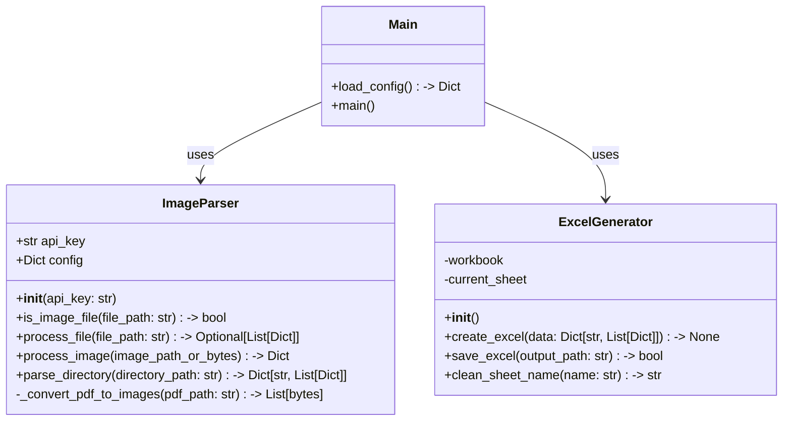
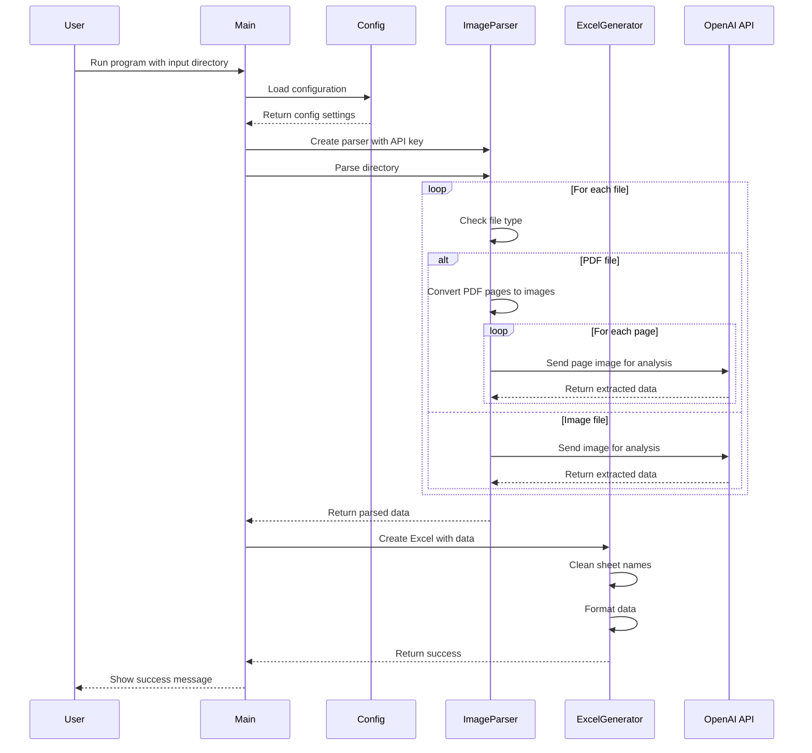

# Image to Excel Converter

This project provides a powerful tool for converting data from images and PDFs into structured Excel files. It uses OpenAI's Vision API to extract text and tabular data from images and automatically formats them into well-organized Excel spreadsheets.

## Features

- Image and PDF text extraction using OpenAI's Vision API
- Automatic data extraction from images and PDFs
- Excel file generation with formatted data
- Support for multiple formats (PDF, PNG, JPEG, JPG)
- Simple command-line interface
- Comprehensive test coverage (88%)
- YAML-based configuration

## Project Structure

```
image-to-excel
├── src
│   ├── main.py                # Entry point of the application
│   ├── parsers
│   │   └── image_parser.py    # Image/PDF processing and text extraction
│   └── generators
│       └── excel_generator.py # Excel file creation and formatting
├── conf
│   └── api_config.yaml       # Configuration settings
├── requirements.txt          # Project dependencies
├── README.md                # Project documentation
├── pytest.ini              # Pytest configuration
└── tests                    # Unit and integration tests
    ├── test_main.py
    ├── test_image_parser.py
    ├── test_excel_generator.py
    └── conftest.py         # Test configuration and fixtures
```

## Class Diagram



## Sequence Diagram



## Libraries Used

### Core Dependencies
- **openai (v1.12.0+)**
  - Used for Vision API integration
  - Handles image analysis and text extraction
  - Supports base64 image encoding

- **openpyxl (v3.1.2+)**
  - Excel file creation and manipulation
  - Sheet formatting and data organization
  - Handles .xlsx file format

- **PyPDF2 (v3.0.0+)**
  - PDF file processing
  - PDF to image conversion
  - Multi-page PDF support

- **Pillow (v10.2.0+)**
  - Image processing and manipulation
  - Image format conversion
  - Base64 encoding support

- **PyYAML (v6.0.1+)**
  - Configuration file parsing
  - YAML format support
  - Safe loading of configuration

- **loguru (v0.7.2+)**
  - Advanced logging functionality
  - Structured log formatting
  - File and console logging

### Development Dependencies
- **pytest (v8.3.0+)**
  - Test framework
  - Fixture support
  - Test discovery and execution

- **pytest-cov (v4.1.0+)**
  - Test coverage reporting
  - Coverage statistics
  - Missing line identification

## Configuration

The application uses a YAML-based configuration file (`conf/api_config.yaml`) for managing settings. Copy `api_config.yaml.example` to `api_config.yaml` and update with your settings:

```yaml
openai:
  api_key: "your-api-key-here"
  vision:
    model: "gpt-4-vision-preview"
    max_tokens: 1000
    messages:
      - role: "user"
        content:
          - type: "text"
            text: "Extract all invoice details from this image including invoice number, date, items, quantities, prices, and totals. Format the response as a JSON object."
          - type: "image"
            image_url: null  # Will be replaced with actual image data

output:
  excel:
    default_filename: "output.xlsx"
```

## Requirements

- Python 3.6 or higher
- Dependencies listed in requirements.txt

## Setup Instructions

1. Clone the repository:
   ```bash
   git clone https://github.com/vallabhallm/image_to_excel.git
   cd image_to_excel
   ```

2. Create and activate a virtual environment (recommended):
   ```bash
   python -m venv .venv
   source .venv/bin/activate  # On Windows: .venv\Scripts\activate
   ```

3. Install the required dependencies:
   ```bash
   pip install -r requirements.txt
   ```

4. Copy the example config and update with your OpenAI API key:
   ```bash
   cp conf/api_config.yaml.example conf/api_config.yaml
   # Edit conf/api_config.yaml with your API key
   ```

## Usage

Run the application:
```bash
python -m src.main <input_directory>
```

The program will:
1. Process all images and PDFs in the input directory
2. Extract data using OpenAI's Vision API
3. Generate an Excel file with the extracted data

## Testing

The project includes a comprehensive test suite. To run the tests:

```bash
# Run tests with coverage report
pytest --cov=src --cov-report=term-missing

# Run tests without coverage
pytest

# Run tests with verbose output
pytest -v
```

### Latest Test Results

```
Name                                Stmts   Miss  Cover   Missing
-----------------------------------------------------------------
src/generators/excel_generator.py      48      4    92%   38, 63-65
src/main.py                            51      1    98%   92
src/parsers/image_parser.py           135     22    84%   66, 75, 124, 146, 161, 200-201, 205-206, 246-248, 254-264, 267
-----------------------------------------------------------------
TOTAL                                 234     27    88%
```

## License

This project is licensed under the MIT License - see the LICENSE file for details.
